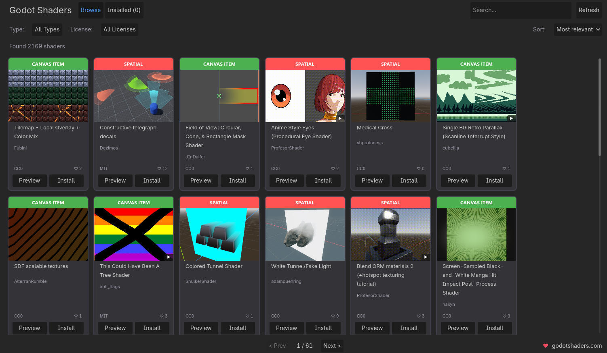
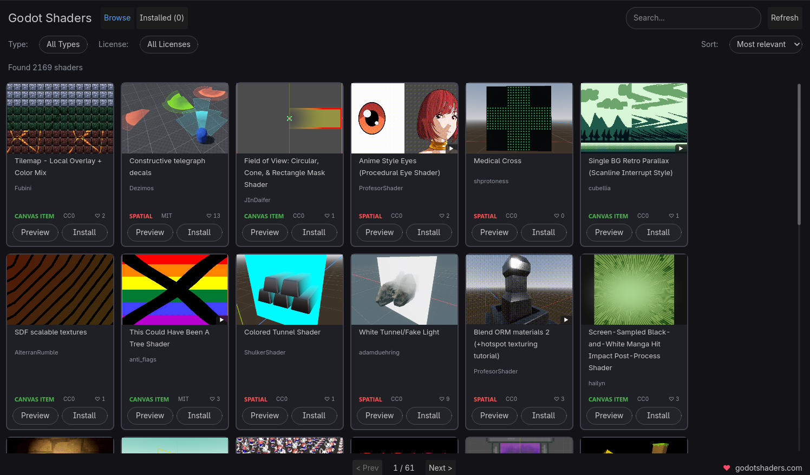

# 🎨 Shader Library - Godot Addon

[](https://godotengine.org)
[](LICENSE)
[](CHANGELOG.md)

> **Disclaimer:** This is an **unofficial** plugin and is not affiliated with or endorsed by [godotshaders.com](https://godotshaders.com).

Browse and install shaders from [godotshaders.com](https://godotshaders.com) directly in the Godot Editor!

> 🎬 **[Watch Video Showcase](https://youtu.be/qrtgDjqs3Uk)** - See the plugin in action!




## ✨ Features

### Core Features
- **🔍 Browse 2000+ Shaders** - Access the entire godotshaders.com library
- **🔎 Smart Search & Filter** - Find shaders by name, author, or category (Spatial, Canvas Item, Particles, Sky, Fog)
- **📥 One-Click Install** - Download shaders directly to your project with a single click
- **🎞️ GIF Preview Support** - Animated GIF previews render as their first frame (with a ▶ badge); click *Watch Video* in the preview dialog to see the full animation in your browser
- **👁️ Rich Preview** - View full shader details:
  - 📸 High-quality preview image
  - 📝 Complete description with clickable links
  - 🏷️ Tags and categories
  - 💻 Full shader code
  - 👤 Author info and license
  - 🔗 Direct link to godotshaders.com

### Workflow Tools
- **🎯 ShaderApplier Node** - Apply shaders via custom inspector node
  - Supports 30+ node types (2D & 3D)
  - Browse library directly from inspector
  - Create new shaders with templates
- **📦 Installed Manager** - View, open, and delete installed shaders

- **💾 Smart Caching** - 24-hour cache with daily auto-updates; image cache uses an in-memory index for snappy page-flips
- **⚡ Snappy Browser** - Debounced search, shared StyleBoxes, single-pass filtering — stays responsive with 2000+ shaders loaded
- **🖥️ HiDPI Support** - Perfect scaling on 4K/high-DPI displays
- **🌍 Multi-Language** - 9 languages supported
- **🎨 Native Godot UI** - Seamless integration with editor theme

## 📦 Installation

### From Godot Asset Library

1. Open Godot 4.x
2. Go to **AssetLib** tab
3. Search for **"Shader Library"**
4. Click **Download** and **Install**
5. Enable in **Project Settings → Plugins**

> ⚠️ **Updating from AssetLib**: Due to a [Godot limitation](https://github.com/godotengine/godot/issues/52891), AssetLib cannot update existing addons. To update:
> 1. **Disable** the plugin in Project Settings → Plugins
> 2. **Delete** the `res://addons/shader_library/` folder from your project
> 3. **Reinstall** from AssetLib
> 4. **Re-enable** the plugin
>
> Alternatively, update via GitHub (see below) which supports direct replacement.

### From GitHub

1. Download the [latest release](https://github.com/Kelpekk/Godot-Shader-Library/releases/latest) (Code → Download ZIP)
2. Copy the `addons/shader_library` folder to your Godot project
3. Open your project in Godot 4.x
4. Go to **Project → Project Settings → Plugins**
5. Enable **Shader Library**
6. Click on **ShaderLib** tab in the top menu bar

> 💡 **Tip**: Installing from GitHub allows easy updates - just replace the addon folder with the new version.

## 🚀 Usage

### Browse Shaders
1. Open the **ShaderLib** tab (top menu bar)
2. Browse through shader cards with previews
3. Use pagination to navigate (40 shaders per page)

### Search & Filter
- Type in the search box and press Enter
- Use dropdown to filter by: All, Spatial (3D), Canvas Item (2D), Particles, Sky, Fog

### Preview Shader
Click **Preview** to see:
- Full-size image
- Author & license info
- Description & tags
- Complete shader code
- Direct link to godotshaders.com

### Install Shader
Click **Install** to download the shader to `res://shaders/shaderlib/` folder.

### Manage Installed
1. Switch to **Installed** tab
2. View all installed shaders
3. Click to open shader in editor
4. Delete shaders with confirmation

### ShaderApplier Node
1. Add **ShaderApplier** node as child of any supported node:
   - **2D (CanvasItem)**: Sprite2D, AnimatedSprite2D, ColorRect, TextureRect, Panel, NinePatchRect, Line2D, Polygon2D, Label, GPUParticles2D, CPUParticles2D, Node2D, Control, and all CanvasItem descendants
   - **3D**: MeshInstance3D, Sprite3D, AnimatedSprite3D, MultiMeshInstance3D, Label3D, CSGShape3D, GPUParticles3D, CPUParticles3D
2. In the inspector, click the shader selector dropdown
3. Select **"📚 Shader Library"** to browse and install shaders
4. Shader is automatically applied to the parent node

## 📁 Structure

```
addons/shader_library/
├── api/
│   ├── cache_manager.gd        # Downloads shader database, indexes image cache
│   ├── gif_decoder.gd          # Pure-GDScript GIF89a decoder (first frame only)
│   ├── installed_manager.gd    # Track installed shaders
│   ├── shader_installer.gd     # Download & install shaders
│   ├── translations.gd         # Multi-language support (9 languages)
│   └── update_checker.gd       # Plugin update notifications
├── ui/
│   ├── gif_player.gd           # Static-frame GIF display (PanelContainer)
│   ├── shader_browser.gd       # Main UI logic
│   └── shader_selector_dialog.gd # Shader selector for inspector
├── CHANGELOG.md                # Version history
├── plugin.cfg                  # Plugin configuration
├── plugin.gd                   # Main plugin entry point
├── shader_applier_inspector.gd # Custom inspector plugin
└── shader_applier.gd           # ShaderApplier custom node
```

## 🌐 Supported Languages

The addon automatically detects your Godot editor language:

| Language | Code |
|----------|------|
| English | en |
| Polski | pl |
| Deutsch | de |
| Español | es |
| Français | fr |
| 中文 | zh_CN |
| 日本語 | ja |
| Русский | ru |
| Português | pt_BR |

## 📋 Requirements

- Godot 4.0 or higher
- Internet connection (for fetching shaders)

## 🤝 Contributing

Contributions are welcome! Feel free to:
- Report bugs
- Suggest features
- Submit pull requests

## 📄 License

MIT License - see [LICENSE](LICENSE) file.

All shader authors retain their original licenses (CC0, MIT, or GPL v3).

## 🙏 Credits

- Shaders from [godotshaders.com](https://godotshaders.com)
- HiDPI Support - [@hapenia](https://github.com/hapenia)
- Video Showcase - [Watch on YouTube](https://youtu.be/qrtgDjqs3Uk)

---

Made with ❤️ for the Godot community
