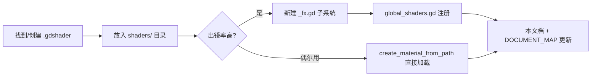

# GlobalShaders Shader 库参考

> 最后更新：2026-06-23（+ ChromaticAberrationFX / SplitGlitchFX / PixelExplosionFX / MultiFilter） | 源码：`scripts/shader/` + `shaders/`
>
> **铁律：实现任何 Shader/VFX 前，必须先查本文档。确认已有 API 是否覆盖需求，避免手写 `ShaderMaterial.new()` + `load()`。**
>
> **外部代码只调 `GlobalShaders.xxx()`，不直接调 ShaderFX 或子系统。**

---

## 架构总览

```
GlobalShaders (autoload, /root/GlobalShaders)
├── const SFX = shader_fx.gd          ← 纯函数库
├── edge_fade: EdgeFadeFX             ← 面板边缘水墨淡出
├── dissolve:  DissolveFX             ← 噪声溶解消散 + 燃烧边框
├── glow:      GlowFX                 ← Sprite 内发光（baked_sprite_glow）
├── outline:   OutlineFX              ← 内外描边（outline2D_inner_outer）
├── chromatic_aberration: ChromaticAberrationFX  ← 色差（故障/受击反馈）
├── split_glitch: SplitGlitchFX       ← 分裂故障（Boss 战过渡）
├── pixel_explosion: PixelExplosionFX ← 像素爆炸消散
│
└── 外部代码 → GlobalShaders.xxx()
     └── 委托 → SFX / subsystem
```

| 组件 | 文件 | 类型 | 定位 |
|------|------|------|------|
| **GlobalShaders** | `scripts/shader/global_shaders.gd` | autoload | 统一入口，对外 API 全部通过它调用 |
| **ShaderFX** | `scripts/shader/shader_fx.gd` | autoload（静态类） | 基础工具：加载/创建/应用/移除材质 + 噪声工具 + 参数补间委托 |
| **EdgeFadeFX** | `scripts/shader/edge_fade_fx.gd` | class_name Node | 面板边缘淡出（`panel_edge_fade.gdshader`） |
| **DissolveFX** | `scripts/shader/dissolve_fx.gd` | class_name Node | 溶解消散（`dissolve2d.gdshader`） |
| **GlowFX** | `scripts/shader/glow_fx.gd` | class_name Node | Sprite 内发光（`baked_sprite_glow.gdshader`） |
| **OutlineFX** | `scripts/shader/outline_fx.gd` | class_name Node | 内外描边（`outline2D_inner_outer.gdshader`） |
| **ChromaticAberrationFX** | `scripts/shader/chromatic_aberration_fx.gd` | class_name Node | 色差（`chromatic_aberration.gdshader`） |
| **SplitGlitchFX** | `scripts/shader/split_glitch_fx.gd` | class_name Node | 分裂故障（`split_glitch.gdshader`） |
| **PixelExplosionFX** | `scripts/shader/pixel_explosion_fx.gd` | class_name Node | 像素爆炸消散（`pixel_explosion.gdshader`） |

### 对应 .gdshader 文件

| Shader | 来源 | 用途 |
|--------|------|------|
| `shaders/panel_edge_fade.gdshader` | 项目自建 | 面板水墨边缘淡出 |
| `shaders/fake3d/dissolve2d.gdshader` | 项目自建 | 噪声溶解 + 燃烧边框 |
| `shaders/fake3d/fake3d.gdshader` | 项目自建 | 卡牌伪 3D 透视（不通过此库管理） |
| `shaders/fake3d/fake3d_flash.gdshader` | 项目自建 | 卡牌稀有度闪光（不通过此库管理） |
| `shaders/fake3d/fake3d_shadow.gdshader` | 项目自建 | 卡牌阴影（不通过此库管理） |
| `shaders/baked_sprite_glow.gdshader` | gdquest | Sprite 内发光 |
| `shaders/outline2D_inner_outer.gdshader` | gdquest | 内外描边 |
| `shaders/filters/multi_filter.gdshader` | 项目合并 | 复合滤镜（灰度/暗角/颜色叠加/混合） |
| `shaders/effects/chromatic_aberration.gdshader` | shaderlist | 色差（故障/受击反馈） |
| `shaders/effects/split_glitch.gdshader` | shaderlist | 分裂故障扰动 |
| `shaders/effects/pixel_explosion.gdshader` | shaderlist | 像素爆炸消散 |

---

## 场景速查（从这里开始！）

| 你想要什么 | 用什么 |
|-----------|--------|
| 面板水墨边缘淡出 | `apply_edge_fade(node)` |
| 移除边缘淡出 | `clear_edge_fade(node)` |
| 卡牌溶解消散（自动清理） | `dissolve_out(node, {duration: 0.8})` |
| 为节点施加溶解材质（不播放） | `apply_dissolve(node, params)` |
| Sprite 辉光发光 | `apply_glow(sprite, {tint_front: Color.YELLOW})` |
| 辉光呼吸脉冲 | `pulse_glow(sprite, {min_intensity: 0.3})` |
| 卡牌选中/悬停描边 | `apply_outline(card, {line_color: Color.RED})` |
| 移除描边 | `clear_outline(node)` |
| **色差故障效果** | `apply_chromatic_aberration(node, {intensity: 0.8})` |
| **移除色差** | `clear_chromatic_aberration(node)` |
| **分裂故障扰动** | `apply_split_glitch(node, {distort_strength: 0.3})` |
| **故障爆发动画** | `split_glitch_burst(node, {duration: 1.0, peak: 0.8})` |
| **移除故障** | `clear_split_glitch(node)` |
| **像素爆炸消散** | `apply_pixel_explosion(node, {strength: 1.5})` |
| **播放消散动画** | `pixel_explode(node, {duration: 0.8})` |
| **移除像素爆炸** | `clear_pixel_explosion(node)` |
| Shader 参数单次补间 | `tween_param(material, "param", to_val, 0.15)` |
| Shader 参数呼吸脉冲 | `pulse_param(material, "param", 0.3, 1.0, 0.8)` |
| 加载 .gdshader 文件 | `load_shader("res://shaders/xxx.gdshader")` |
| 创建 ShaderMaterial | `create_material(shader, {param: val})` |
| 为节点设置材质 | `apply_material(node, mat)` |
| 节点退出时批量清理 | `remove_all_shaders(node)` |

---

## 1. GlobalShaders — 统一入口（autoload）

**文件：** `scripts/shader/global_shaders.gd`

**不要直接调子系统。所有 Shader 效果都通过 GlobalShaders 调用。** 它是胶水层，内部持有各子系统实例，提供统一 API。

### 1.1 边缘淡出

```gdscript
func apply_edge_fade(node: CanvasItem, fade_start: float = 0.64) -> void
func clear_edge_fade(node: CanvasItem) -> void
func has_edge_fade(node: CanvasItem) -> bool
```

`fade_start` 控制淡出起始 UV.x 位置（0.0-1.0），值越大透明区域越小。

### 1.2 溶解消散

```gdscript
func apply_dissolve(node: CanvasItem, params: Dictionary = {}) -> ShaderMaterial
func dissolve_out(node: CanvasItem, params: Dictionary = {}) -> Tween
func clear_dissolve(node: CanvasItem) -> void
func has_dissolve(node: CanvasItem) -> bool
```

`params` 支持：`dissolve_value`, `burn_border_size`（默认 0.2）, `burn_color`（默认 橙色）。

`dissolve_out` 施加材质 → 播放动画 → `queue_free`。返回 Tween 可 await。
额外支持 `duration`（默认 1.0）。

```gdscript
# 标准消散
await GlobalShaders.dissolve_out(card, {duration: 0.8, burn_color: Color.ORANGE_RED})

# 只应用溶解材质，后续手控参数
var mat := GlobalShaders.apply_dissolve(card, {burn_border_size: 0.3})
GlobalShaders.tween_param(mat, "dissolve_value", 0.0, 1.0)
```

### 1.3 发光

```gdscript
func apply_glow(node: CanvasItem, params: Dictionary = {}) -> ShaderMaterial
func pulse_glow(node: CanvasItem, params: Dictionary = {}) -> Tween
func clear_glow(node: CanvasItem) -> void
func has_glow(node: CanvasItem) -> bool
```

`params` 支持：

| 参数 | 类型 | 默认值 | 说明 |
|------|------|--------|------|
| `tint_front` | Color | WHITE | 前层发光色调 |
| `tint_back` | Color | WHITE | 后层发光色调 |
| `alpha_falloff_front` | float | 1.0 | 前层透明度衰减（0-3） |
| `alpha_falloff_back` | float | 1.0 | 后层透明度衰减（0-3） |
| `blend_amount` | float | 1.0 | 前后层混合比例（0-1） |
| `falloff_max_alpha` | float | 1.0 | 衰减最大 alpha 阈值（0-1） |

`pulse_glow` 额外参数：`min_intensity`（默认 0.3），`max_intensity`（默认 1.0），`duration`（默认 0.8）。

```gdscript
# 黄色发光
GlobalShaders.apply_glow(icon, {tint_front: Color(1, 0.8, 0.2)})

# 呼吸脉冲
GlobalShaders.pulse_glow(icon, {min_intensity: 0.3, max_intensity: 1.0, duration: 0.6})
```

### 1.4 描边

```gdscript
func apply_outline(node: CanvasItem, params: Dictionary = {}) -> ShaderMaterial
func clear_outline(node: CanvasItem) -> void
func has_outline(node: CanvasItem) -> bool
```

`params` 支持：`line_color`（Color），`line_thickness`（0-10，默认 1.0）。

适用于 TextureRect/Sprite2D 等基于纹理透明度的描边，自动检测内边缘（透明→不透明交界）和外边缘（不透明→透明交界）。

```gdscript
# 红色粗描边，用于选中状态
GlobalShaders.apply_outline(card, {line_color: Color.RED, line_thickness: 2.0})
```

### 1.5 色差

```gdscript
func apply_chromatic_aberration(node: CanvasItem, params: Dictionary = {}) -> ShaderMaterial
func clear_chromatic_aberration(node: CanvasItem) -> void
func has_chromatic_aberration(node: CanvasItem) -> bool
```

`params` 支持：`intensity`（0.0-1.0，默认 0.6），`red_amount` / `green_amount` / `blue_amount`（RGB 偏移量），`radial`（径向模式），`angle`，`jitter_speed` / `jitter_strength`（抖动），`samples`（采样质量 1-8）。

```gdscript
# 受击色差闪烁
var mat := GlobalShaders.apply_chromatic_aberration(node, {intensity: 0.8})
GlobalShaders.tween_param(mat, "intensity", 0.0, 0.3)

# 持续故障效果
GlobalShaders.apply_chromatic_aberration(node, {
	intensity: 0.4, jitter_speed: 3.0, jitter_strength: 0.005
})
```

### 1.6 分裂故障

```gdscript
func apply_split_glitch(node: CanvasItem, params: Dictionary = {}) -> ShaderMaterial
func split_glitch_burst(node: CanvasItem, params: Dictionary = {}) -> Tween
func clear_split_glitch(node: CanvasItem) -> void
func has_split_glitch(node: CanvasItem) -> bool
```

`params` 支持：`distort_strength`（扰动强度），`grid_size_base` / `grid_size_max_add`（网格粒度），`time_cycle`（波动周期），`wave_frequency`（波纹频率），`clamp_uv`（是否限制 UV 范围）。

`split_glitch_burst` 播放一次"从 0 → peak → 0"的故障爆发动画。额外支持 `duration`（默认 1.0）和 `peak`（默认 0.8）。

```gdscript
# 持续扰动
GlobalShaders.apply_split_glitch(node, {distort_strength: 0.15, time_cycle: 3.0})

# 爆发动画
await GlobalShaders.split_glitch_burst(node, {duration: 0.8, peak: 0.9})
GlobalShaders.clear_split_glitch(node)
```

### 1.7 像素爆炸

```gdscript
func apply_pixel_explosion(node: CanvasItem, params: Dictionary = {}) -> ShaderMaterial
func pixel_explode(node: CanvasItem, params: Dictionary = {}) -> Tween
func clear_pixel_explosion(node: CanvasItem) -> void
func has_pixel_explosion(node: CanvasItem) -> bool
```

`params` 支持：`progress`（-1.0~1.0），`strength`（爆炸力度），`noise_tex_normal` / `noise_tex`（自定义噪声纹理）。

`pixel_explode` 播放完整消散动画（progress -1 → 1），完成后自动清理材质。额外支持 `duration`（默认 0.8），`peak_strength`（默认 1.0）。

```gdscript
# 消散动画
await GlobalShaders.pixel_explode(node, {duration: 1.0, peak_strength: 1.5})

# 只挂材质手控参数
GlobalShaders.apply_pixel_explosion(node, {strength: 0.5})
```

### 1.8 滤镜（MultiFilter — 灰度/暗角/颜色叠加）

multi_filter 不通过 GlobalShaders 子系统管理，直接通过 `ShaderFX` 工具方法使用：

```gdscript
var shader := GlobalShaders.load_shader("res://shaders/filters/multi_filter.gdshader")
var mat := GlobalShaders.create_material(shader, {mode: 1, vignette_intensity: 0.6})
GlobalShaders.apply_material(node, mat)
```

`mode` 值：0=灰度, 1=暗角, 2=颜色叠加, 3=混合（灰度+暗角）。

```gdscript
# 灰度模式
var gs := GlobalShaders.create_material_from_path(
	"res://shaders/filters/multi_filter.gdshader",
	{mode: 0}
)
GlobalShaders.apply_material(node, gs)

# 叠加色调
var tint := GlobalShaders.create_material_from_path(
	"res://shaders/filters/multi_filter.gdshader",
	{mode: 2, overlay_color: Color(1.0, 0.5, 0.5, 1.0)}
)
GlobalShaders.apply_material(node, tint)
```

### 1.9 Shader 参数动效

```gdscript
func tween_param(material: ShaderMaterial, param_name: String, to_value: Variant,
    duration: float = 0.15, auto_kill: bool = true) -> Tween

func pulse_param(material: ShaderMaterial, param_name: String, min_val: float, max_val: float,
    cycle_duration: float = 0.8, auto_kill: bool = true) -> Tween
```

- `tween_param`：将 `material.shader_parameter/<param_name>` 从当前值补间到 `to_value`。EASE_OUT SINE。通过 GlobalShaders 节点创建 Tween（始终在场景树中）。
- `pulse_param`：无限循环在 `min_val ↔ max_val` 之间，EASE_IN_OUT SINE，半周期 = `cycle_duration / 2`。适用于呼吸发光等持续性动效。

### 1.10 Shader 资源管理快捷方法

```gdscript
func load_shader(path: String) -> Shader
func create_material(shader: Shader, params: Dictionary = {}) -> ShaderMaterial
func create_material_from_path(path: String, params: Dictionary = {}) -> ShaderMaterial
func apply_material(node: CanvasItem, mat: ShaderMaterial, duplicate_if_shared: bool = true) -> void
func has_shader(node: CanvasItem) -> bool
func get_material(node: CanvasItem) -> ShaderMaterial
func remove_material(node: CanvasItem) -> void
func remove_all_shaders(node: CanvasItem) -> void
```

---

## 2. ShaderFX — 静态工具库（autoload）

**文件：** `scripts/shader/shader_fx.gd`

**核心特征：**
- 所有方法为 `static func`，`SFX.xxx()` 直接调用
- 无状态管理，纯工具函数
- 可独立作为 autoload 使用（`/root/ShaderFX`）

| 方法 | 说明 |
|------|------|
| `load_shader(path)` | 加载 .gdshader 资源 |
| `create_material(shader, params)` | 创建 ShaderMaterial 并设初始参数 |
| `create_material_from_path(path, params)` | 从文件路径创建 ShaderMaterial |
| `apply_material(node, mat, duplicate)` | 应用材质到节点（默认 duplicate 避免共享冲突） |
| `remove_material(node)` | 移除材质（设 material = null） |
| `has_shader(node)` | 检查节点是否有 ShaderMaterial |
| `get_material(node)` | 获取节点的 ShaderMaterial |
| `set_param(mat, name, value)` | 设置 Shader 参数（安全版，检查 material 有效性） |
| `get_param(mat, name)` | 获取 Shader 参数 |
| `create_dissolve_noise(seed)` | 创建 FastNoiseLite 噪声纹理（Value FBM，256×256） |
| `randomize_noise_seed(mat, param)` | 随机化 dissolve 噪声种子 |
| `tween_param(...)` | 委托 GlobalTweens.tween_shader_param |
| `pulse_param(...)` | 委托 GlobalTweens.shader_pulse |

---

## 3. Shader 资产管理

### 3.1 目录结构约定

```
shaders/                         ← 所有 .gdshader 统一在此目录下
├── panel_edge_fade.gdshader     ← 项目自建：面板水墨边缘淡出
├── baked_sprite_glow.gdshader   ← gdquest：Sprite 内发光
├── outline2D_inner_outer.gdshader ← gdquest：内外描边
├── fake3d/                      ← 卡牌伪 3D 系列（不通过此库管理）
│   ├── fake3d.gdshader
│   ├── fake3d_flash.gdshader
│   ├── fake3d_shadow.gdshader
│   └── dissolve2d.gdshader
├── shaderlib/                   ← ShaderLib 插件下载（godotshaders.com）
│   └── (自动管理，已有 Balatro 风格全息/描边/发光 shader)
└── (新增 .gdshader 统一放此处)
```

| 路径 | 用途 | 来源管理 |
|------|------|---------|
| `shaders/` | 自有 shader + 手动引入的 shader | Git 追踪，手动维护 |
| `shaders/fake3d/` | 卡牌系统专属 shader | Git 追踪，手动维护 |
| `shaders/shaderlib/` | ShaderLib 插件下载的 shader | 插件自动管理，Git 追踪（可 .gitignore） |

### 3.2 Shader 来源对应关系

| 来源 | 集成方式 | shader 路径 | 子系统 |
|------|---------|------------|--------|
| **项目自建** | 手写 .gdshader | `shaders/` | `scripts/shader/*_fx.gd` |
| **gdquest-demos/godot-shaders** | 手动复制到 `shaders/` | `shaders/*.gdshader` | 自行封装或 GlobalShaders 直接加载 |
| **kelpekk/Godot-Shader-Library (ShaderV)** | `.gdshaderinc` 在 `addons/shaderV/`，VisualShader 节点或代码 #include | `addons/shaderV/*/*.gdshaderinc` | 代码中用 `#include` 或在 VisualShader 中拖节点 |
| **godotshaders.com（通过 ShaderLib 插件）** | 编辑器内 ShaderLib 标签 → Install | `shaders/shaderlib/` | 通过 `create_material_from_path()` 加载 |

---

## 4. Shader 子系统开发规范

### 4.1 新增 shader 到 Subsystem 的标准流程



### 4.2 什么时候新建子系统

参考 **Tween 库规范**（§4.5 新增方法规范）：

| 类型 | 做法 | 示例 |
|------|------|------|
| 需要状态管理（节点追踪/清理） | 新建 `class_name XX_FX extends Node` | DissolveFX（追踪 `_active` 字典） |
| 纯参数设置，无状态 | 直接放 `global_shaders.gd` 委托 SFX | `tween_param()`, `pulse_param()` |
| 一次性的临时 shader | `create_material_from_path()` 直接使用，不建子系统 | ShaderLib 下载的试验性 shader |

### 4.3 子系统模板

```gdscript
# scripts/shader/my_effect_fx.gd
class_name MyEffectFX
extends Node

const SHADER_PATH: String = "res://shaders/my_effect.gdshader"

var _shader: Shader
var _active: Dictionary = {}  # node -> ShaderMaterial

func _init() -> void:
    _shader = load(SHADER_PATH) as Shader
    if _shader == null:
        push_error("MyEffectFX: 无法加载 shader: ", SHADER_PATH)

func apply(node: CanvasItem, params: Dictionary = {}) -> ShaderMaterial:
    # 创建材质 + 设参数 + 挂到节点 + 追踪
    ...

func cleanup(node: CanvasItem) -> void:
    # 移除材质 + 清理追踪
    ...

func is_applied(node: CanvasItem) -> bool:
    return _active.has(node) and is_instance_valid(_active[node])
```

然后在 `global_shaders.gd` 中注册：

```gdscript
const _MyEffectFX = preload("res://scripts/shader/my_effect_fx.gd")

# 在 _init_subsystems() 中：
my_effect = _MyEffectFX.new()
my_effect.name = "MyEffectFX"
add_child(my_effect)

# 对外 API：
func apply_my_effect(node: CanvasItem, params: Dictionary = {}) -> ShaderMaterial:
    return my_effect.apply(node, params)
```

---

## 5. 维护管理

### 5.1 新增 shader 的完整工作流

```
1. 获取 shader 文件
   ├── 自建 → 手写 .gdshader → 放入 shaders/
   ├── gdquest → 复制 .gdshader → 放入 shaders/
   ├── ShaderV → 复制 .gdshaderinc → 放入 shaders/ 或 #include 继承
   └── ShaderLib 插件 → 编辑器内 Install → 自动放入 shaders/shaderlib/

2. 评估是否需要子系统
   ├── 经常用 → 新建 scripts/shader/xxx_fx.gd
   ├── 偶尔用 → 代码里 create_material_from_path() 直接加载
   └── 试验/评估中 → 先放 shaderlib/ 下，后续再决定是否封装

3. 注册（仅子系统需要）
   └── global_shaders.gd 追加 preload + 子系统实例 + 对外 API

4. 文档同步（必做）
   ├── 本文档 §场景速查 + §1.x 追加 API
   ├── docs/ninking/DOCUMENT_MAP.md 更新
   └── docs/ninking/README.md 更新索引

5. Git 提交
   └── shader 文件 + 子系统脚本 + 文档一起提交
```

### 5.2 与 Tween 库的关系

| 对比项 | Tween 库 | Shader 库 |
|--------|---------|-----------|
| 入口 Autoload | `GlobalTweens` | `GlobalShaders` |
| 纯函数库 | `TweenFX` | `ShaderFX` |
| 子系统 | ScreenShake, CardTilt 等 | DissolveFX, GlowFX, OutlineFX, EdgeFadeFX |
| 扩展入口 | `NinKingTween`（RefCounted） | →（可参考扩展） |
| 文档 | `docs/tween-library-reference.md` | `docs/shader-library-reference.md` |

**Shader 参数动效由 Tween 库驱动**：`tween_param()` / `pulse_param()` 内部委托 `GlobalTweens.tween_shader_param()` / `shader_pulse()`。两者是**互补关系**，不是竞争关系。

### 5.3 外部 Shader 库的维护

#### gdquest-demos/godot-shaders（已用）
- 使用了 `baked_sprite_glow.gdshader` + `outline2D_inner_outer.gdshader`
- 后续如需更多效果，从 `/tmp/godot-shaders/godot/Shaders/` 复制需要的 `.gdshader`
- 复制后自行封装子系统或直接 `create_material_from_path()` 加载

#### kelpekk/Godot-Shader-Library（ShaderV）
- 位于 `addons/shaderV/`，不是编辑器插件，是 VisualShader 节点库 + shader include
- **两种用法：**

**用法一：代码中 #include**
```gdscript
// 在你的 .gdshader 文件中：
shader_type canvas_item;
#include "res://addons/shaderV/rgba/bloom.gdshaderinc"
#include "res://addons/shaderV/uv/twirl.gdshaderinc"

void fragment() {
    COLOR = texture(TEXTURE, UV);
    COLOR.rgb = _bloomFunc(COLOR.rgb, 1.0);
}
```

**用法二：VisualShader 编辑器拖节点**
- 创建 ShaderMaterial → Shader 类型选 VisualShader
- 打开编辑器 → 在 RGBA/UV/Tools 分类中找到节点

#### ShaderLib 插件（kelpekk/Godot-Shader-Library 的插件版本）
- 位于 `addons/shader_library/`，是真正的编辑器插件
- 顶部菜单出现 **ShaderLib** 标签 → 浏览 godotshaders.com → Install → `shaders/shaderlib/`
- 安装后用 `GlobalShaders.create_material_from_path("res://shaders/shaderlib/xxx.gdshader")` 加载

### 5.4 卸载/清理 shader

要彻底移除一个 shader 效果：

```
1. 清理所有调用方代码（搜索 shader 路径或参数名）
2. 删除 .gdshader 文件（以及对应的 .gdshaderinc）
3. 如有子系统，删除 _fx.gd 文件 + 从 global_shaders.gd 移除引用
4. 同步更新本文档
```

---

## 6. 使用规则

1. **优先 GlobalShaders** — 先查本文档确认是否有已有 API，避免手写 `ShaderMaterial.new()`
2. **外部代码只调 GlobalShaders** — 不直接调 ShaderFX 或子系统（autoload 顺序需要除外）
3. **材质独享实例** — `apply_material()` 默认 `duplicate_if_shared=true`
4. **清理** — 节点退出场景树时调用 `clear_xxx()` 或 `remove_all_shaders()`
5. **Tween 集成** — shader 参数动效通过 GlobalTweens 驱动
6. **向后兼容** — `TweenFX.dissolve_out()` 保持可用，但新代码用 `GlobalShaders.dissolve_out()`
7. **Fake3D 不归此库** — 卡牌系统的 `fake3d.gdshader` 系列维持原加载方式，不通过此库管理
8. **新增必更新文档** — 新增 shader/子系统后，同步更新本文档 + DOCUMENT_MAP + README

---

## 7. 安全清单

- [ ] ShaderMaterial 已 `duplicate()`？多节点共享同一材质会导致参数冲突
- [ ] 节点退出场景树时已清理？防止 dangling 引用
- [ ] 已查本文档是否有现成 API？避免重复
- [ ] 使用 `GlobalShaders.xxx()` 而非直接操作 material
- [ ] 溶解效果后已清理 `use_parent_material`？DissolveFX 会在完成时自动恢复
- [ ] 新建子系统后已在 `global_shaders.gd` 注册？
- [ ] .gdshaderinc 文件路径是否正确？（`#include` 路径在运行时解析）
- [ ] 从外部库复制 shader 时已检查 Godot 版本兼容性？（Godot 4.x `source_color` 语法）
